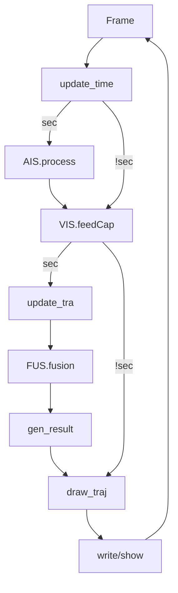

<!--
Bu dosya: Entegre AIS + VIS + FUS pipeline'ını ORJINAL README'dEKİ açıklık seviyesinden DAHA DETAYLI anlatır.
Odağı: Zamanlama, veri yaşam döngüsü, maliyet fonksiyonu, durum makinesi, tuning ve hata ayıklama.
-->

# AIS + VIS + FUS Entegre İşlem Zinciri (Derinlemesine Dokümantasyon)

**Amaç (tek cümle):** Kameradan gelen görsel ID akışını saniyelik AIS gerçek dünya kimliğiyle güvenilir şekilde eşleştirip kalıcı kimlik (ID↔MMSI) ilişkisi oluşturmak.

**İlişkili Artifaktlar:** `docs/Integration_Documentation.docx`, `docs/flowchart_integration.png`.

---
## 0. Üst Düzey Özet (TL;DR)
Her kare: YOLOX tespit + DeepSORT takip. Her saniye: AIS dosyası okunur, filtrelenir, eksik saniyeler ileriye projekte edilir, piksel uzayına dönüştürülür. Ardından geçmiş VIS & AIS trajeleri hizalanır (DTW_fast), açısal + mesafe kapıları uygulanır, Hungarian ile en düşük toplam maliyetli eşleşmeler seçilir, kısa kayıplar korunur (fog tolerance). Çıktı CSV + overlay güncellenir.

---
## 1. Zamanlama Modeli (İki Saat Mantığı)
| Bileşen | Frekans | Tetik | Not |
|---------|---------|-------|-----|
| Tespit (YOLOX) | Her kare | Frame döngüsü | GPU yoğun |
| Takip (DeepSORT) | Her kare | Tespit sonrası | Kimlik sürekliliği |
| AIS İşleme | 1 Hz | Yeni saniye (timestamp geçişi) | Dosya tabanlı akış |
| Fusion | 1 Hz | AIS + update_tra tamamlanınca | VIS & AIS snapshot senkron |
| Sonuç Yazımı | 1 Hz | Fusion sonrası | 3 ayrı CSV |
| Çizim | Her kare | Frame döngüsü | Son bilinen fusion durumu işlenir |

Yeni saniye algısı: `update_time` içinde kare zamanından türetilen milisaniye → önceki saniyeyi aştıysa `is_new_second=True`.

---
## 2. Ana Döngü Psödo Kodu
```pseudo
while video_acik:
  frame = capture()
  is_new_second = update_time()
  if is_new_second:
    AIS_cur, AIS_vis = AIS.process()
  Vis_frame_out = VIS.feedCap(frame)
  if is_new_second:
    Vis_cur, Vis_tra = VIS.update_tra()
    mat_list, bin_cur = FUS.fusion(AIS_cur, AIS_vis, Vis_cur, Vis_tra)
    gen_result(mat_list, Vis_cur, detections)
  draw_traj(frame, bin_cur, Vis_frame_out)
  write/show
```

---
## 3. Veri Yaşam Döngüsü
1. Kaynaklar: (a) Video kareleri (b) AIS saniyelik CSV'leri.
2. AIS satırı okunur → kaba filtre (MMSI geçerli? hız mantıklı? mesafe / FOV içinde mi?).
3. Eksik saniyeler geodetic ileri projeksiyon (hız + course) ile doldurulur (TIME_OFFSET uygulanmış zaman çizelgesi üzerinde).
4. Lat/Lon → Kameraya göre relatif mesafe + bearing → Kameraya özel projeksiyon → Piksel (x,y).
5. VIS tarafında kare bazlı bounding box'lar ID'lenir; saniyede bir ID için tek temsil (ortalama merkez + tahmini hız/yön) çıkarılır.
6. Fusion benzerlik matrisi: Her VIS ID vs AIS MMSI için maliyet hesaplanır.
7. Hungarian ile minimum toplam maliyetli eşleştirme → Kapı sonrası geçerli çiftler `bin_cur`.
8. İstikrar sayaçları (match count) güncellenir; kayıplar düşük süreli ise korunur.
9. CSV'lere yazılır, overlay renklendirilir (eşleşmiş = sarı, değil = kırmızı).

---
## 4. AIS İşleme (Detaylı)
Adım | Fonksiyon | Neden
-----|-----------|------
Reset | `initialization` | Saniyelik state sızıntısını önler.
Okuma | `read_ais` | O saniye dosyasını parse eder.
Filtre | `data_coarse_process` | Gürültü + mantıksız veriyi ayıklar.
Tahmin | `data_pred` + `data_pre` | Eksik saniyelerde süreklilik.
Offset | (data_pred içinde) | Video–AIS saat farkını telafi.
Dönüşüm | `data_tran` → `transform` + `visual_transform` | Ortak koordinat sistemi.
Pencere | (AIS_vis) | DTW için geçmiş bağlam.

Önemli Nüans: Hız=0 iken yön güvenilmez → açısal karşılaştırmada bu durum cezalandırılmayacak şekilde (veya nötr) ele alınır.

---
## 5. VIS İşleme (Detaylı)
Adım | Fonksiyon | Açıklama
-----|-----------|---------
Tespit | `detection` | YOLOX model ileri besleme.
Örtüşme | `anti_occ` | Kısmi; olası kaybolan ID koruma girişimi.
Takip | `track` | Kalman + appearance embedding + Hungarian.
Saniyelik Özet | `update_tra` | Aynı ID'nin saniyelik tekleştirilmesi, hız/yön çıkarımı, pencere güncelleme.

`Vis_tra`: Son N saniye (örn. ~120) için ID → [(t,x,y), ...] listeleri. DTW_fast girdi sekansı.

---
## 6. Fusion (Detaylı)
Alt Bileşen | Fonksiyon | Rol
------------|-----------|----
Traje Gruplama | `traj_group` | ID bazlı zaman serisi hazırlama.
Başlatma | `initialization` | Önceki eşleşmeleri / sayaçları çekme.
Benzerlik | `cal_similarity` | Çift bazlı maliyet üretimi.
Optimizasyon | Hungarian (`linear_assignment`) | Global minimum eşleme.
Kapı | `data_filter` | Mesafe & açı ile son süzgeç.
Kalıcılık | `save_data` | Fog tolerance, sayaç artışı, `bin_cur`.

---
## 7. Benzerlik (Maliyet) Fonksiyonu Ayrışımı
Toplam Maliyet ≈ (d_norm * w_d) + (angle_penalty * w_a) + (dtw_cost * w_t) - (continuity_bonus)

Bileşen | Açıklama | Normalizasyon | Etki
--------|----------|---------------|-----
Mesafe (d_norm) | Son piksel mesafesi | max_dis'e oran | Yakınlık temel kapı
Açı (angle_penalty) | Yön farkı derecesi | Derece / açı_limit | Büyük sapma cezalandırılır
DTW_cost | Zaman serisi yol maliyeti | Downsample sonrası raw | Desen benzerliği
Continuity | Önceden bağlı çift ödülü | Sayaç temelli | Stabil eşlemeyi korur

Ön Gating: d > max_dis veya açı > limit ise maliyet = Çok Büyük (ya da skip) → Hungarian'a pratikte etkisiz.

---
## 8. DTW_fast İç Adımları
1. Sekans uzunluğu > eşik ise yarıya indirme (her 2. nokta) – yinelemeli.
2. `fastdtw` ile (x,y) dizisi arasında yol arama.
3. Yol üzerindeki her adım için açısal fark penalti ekleme (opsiyonel).
4. Uzunluk dengesizliği kaynaklı aşırı cezayı sınırlandırma.
Kazanç: O(N^2) klasik DTW yerine yaklaşık O(N) - pratikte hızlı.

---
## 9. Hungarian Sonrası Karar Ağaçları
Durum | Şart | İşlem
------|------|------
Geçerli Eşleşme | Kapılar geçti | Sayaç++ , bin_cur güncelle
Zayıf Eşleşme | Kapı fail | Atla, continuity sıfırlanabilir
Yeni VIS ID | AIS yok | Beklemeye alın (fog penceresi)
Yeni AIS MMSI | VIS yok | Tek başına izlenir (potansiyel gelecekte eşleşir)
Çatışma | 2 VIS aynı AIS kazandı (olmaz - Hungarian) | Hungarian bunu engeller

---
## 10. Fog Tolerance (Kaybolma Dayanımı)
Amaç: Kısa süreli occlusion / AIS paket eksikliği sırasında eşleşmeyi koparmamak.
Mekanizma: `match_count` ve `last_seen` tutularak belli eşik (ör: 2–3 saniye) aşılmadıkça bağ korunur. Çizimde kutu sarı kalır → operatör sürekliliği hisseder.

---
## 11. Binding (Bağ) Durum Makinesi
Durum | Tanım | Geçiş Tetikleyici | Sonraki
------|------|-------------------|--------
UNBOUND | Henüz eşleşmemiş VIS ya da AIS | Gating + düşük maliyet | CANDIDATE
CANDIDATE | İlk başarılı eşleşme | İstikrar eşiği (match_count ≥ K) | STABLE
STABLE | Kalıcı ilişki | Kayıp (no match) ≤ tolerans | STABLE_LOST
STABLE_LOST | Geçici kayıp takibi | Süre dolmadan eşleşme döner | STABLE
EXPIRED | Tolerans aşıldı | Zaman aşımı | UNBOUND

---
## 12. Veri El Sıkışmaları (Genişletilmiş)
| Kaynak | Üretilen | Biçim | Tüketen |
|--------|----------|------|---------|
| AIS.process | AIS_cur | Liste satırları | Fusion, draw |
| AIS.process | AIS_vis | MMSI→traj dict | Fusion (DTW) |
| VIS.feedCap | frame_detections | Box list | track() |
| track | frame_tracks | ID'li kutular | update_tra |
| update_tra | Vis_cur | Saniyelik ID kayıtları | Fusion, draw |
| update_tra | Vis_tra | ID→traj dict | Fusion (DTW) |
| FUS.fusion | mat_list | Eşleşme satırları | gen_result |
| FUS.fusion | bin_cur | Aktif bağ listesi | draw |
| gen_result | CSV dosyaları | disk | Analiz |

---
## 13. Örnek Sayısal Senaryo
Varsayım: max_dis=200 px, açı_limit=45°.
Çift: VIS#12 ↔ MMSI 2710
Son mesafe: 68 px → d_norm=0.34 → katkı ≈ 0.34 * w_d.
Yön farkı: 12° → penalty = 12/45 ≈ 0.27 → katkı ≈ 0.27 * w_a.
DTW_fast: Sekans maliyeti 5.8 → katkı ≈ 5.8 * w_t.
Continuity: 6 ardışık saniye → bonus = B (ör: 1.5).
Toplam ≈ 0.34w_d + 0.27w_a + 5.8w_t - 1.5.
Eğer alternatif çiftin DTW maliyeti yüksek (örn. 12) ise Hungarian bu çifti tercih eder.

---
## 14. Parametreler (Seçim Gerekçeleri)
Parametre | Rol | Etki Fazla / Az
----------|-----|----------------
TIME_OFFSET | Zaman hizalama | Yanlışsa tüm fusion boş
max_dis | İlk geometrik kapı | Çok düşük: eşleşme kaçırır / Çok yüksek: yanlış pozitif
açı_limit | Yön toleransı | Çok düşük: keskin dönüşlerde kopma
DTW downsample faktörü | Hızlandırma | Çok agresif: ince desen farkları kaybolur
continuity bonus katsayısı | Stabilizasyon | Çok yüksek: kilitlenme (yanlış eşleşmeye yapışma)
fog tolerans süresi | Geçici kayıp toleransı | Çok yüksek: hayalet eşleşme sürer

---
## 15. Tuning Rehberi (Adımlı)
1. Zaman Doğrulama: Aynı kare overlay + AIS piksel (debug çiz) → büyük fark varsa TIME_OFFSET ayarla.
2. max_dis Kalibrasyonu: İlk 2–3 dakika ham mesafeleri istatistikle (median + 95p) gözlemle; 95p * 1.1 öner.
3. Açı Limit: Deniz trafiği tipine göre 30°–60° bandı.
4. DTW Ağırlığı (w_t): Çok yüksekse lokal anlık uzaklıklar görmezden gelinir; orta skala öner (örn: mesafe bileşeninden biraz küçük).
5. Continuity Bonus: Yanlış eşleşme “yapışıyorsa” düşür.
6. Fog Süresi: Görsel kaybolma süre histogramı çıkar → 90p değeri alın.

---
## 16. Hata Ayıklama Checklist
[ ] AIS CSV okunuyor mu? (dosya adı / yol)
[ ] TIME_OFFSET doğru mu? (bilinen referans gemi)
[ ] Piksel dönüşüm tutarlı mı? (bilinen koordinat test)
[ ] VIS ID jitter var mı? (takip parametreleri)
[ ] Fusion boşsa: mesafe & açı dağılımına bak → kapılar çok sıkı mı?
[ ] Yanlış eşleşme: continuity bonus düşür + DTW ağırlığını artır.
[ ] Performans düşüşü: downsample derinliği artır.

---
## 17. Glossary
Terim | Açıklama
------|---------
MMSI | Geminin AIS kimlik numarası.
VIS ID | DeepSORT tarafından atanan geçici kimlik.
DTW | Dynamic Time Warping – sekans şekil hizalama.
Hungarian | Global ikili eşleme optimizasyon algoritması.
Fog Tolerance | Geçici kayıp toleransı mekanizması.
Trajectory Window | DTW için tutulan geçmiş noktalar dizisi.

---
## 18. Mermaid Akışı


---
## 19. Pseudocode (Fusion İç Mantık)
```pseudo
for vis_id in VIS_traj:
  for ais_id in AIS_traj:
   if distance(vis_last, ais_last) > max_dis: continue (assign huge cost)
   ang = angle_diff(vis_heading, ais_heading)
   if ang > angle_limit: continue (huge cost)
   dtw_cost = DTW_fast(vis_seq, ais_seq)
   cost = w_d*dist_norm + w_a*(ang/angle_limit) + w_t*dtw_cost
   if was_matched_last_second(vis_id, ais_id):
     cost -= continuity_bonus
Hungarian -> candidate_pairs
apply secondary gates -> accepted_pairs
update match_count / last_seen / bin_cur
```

---
## 20. Gelecek İyileştirme Önerileri
1. Anti-occlusion tamamlanması (görsel yeniden doğuş engelleme).
2. Derin özellik benzerliğinin (embedding distance) fusion maliyetine eklenmesi.
3. Adaptif max_dis (mesafe → zamanla hız tahminiyle ölçekleme).
4. Probabilistik filtre (IMM / Unscented Kalman) ile smoother heading.
5. AIS veri gecikme modellemesi (buffered alignment).
6. Online anomali tespiti (tuhaf hız / yön kırılmaları anında işaretleme).

---
## 21. Kısa Özet (Tek Satır)
"Saniyelik gerçek dünyayı (AIS) kare bazlı görsel kimliklerle, zaman-serisi şekil + yön + mesafe üçlüsünü optimize ederek birleştiren stabil ID↔MMSI eşleme makinesi."

Hazırlayan: GitHub Copilot
