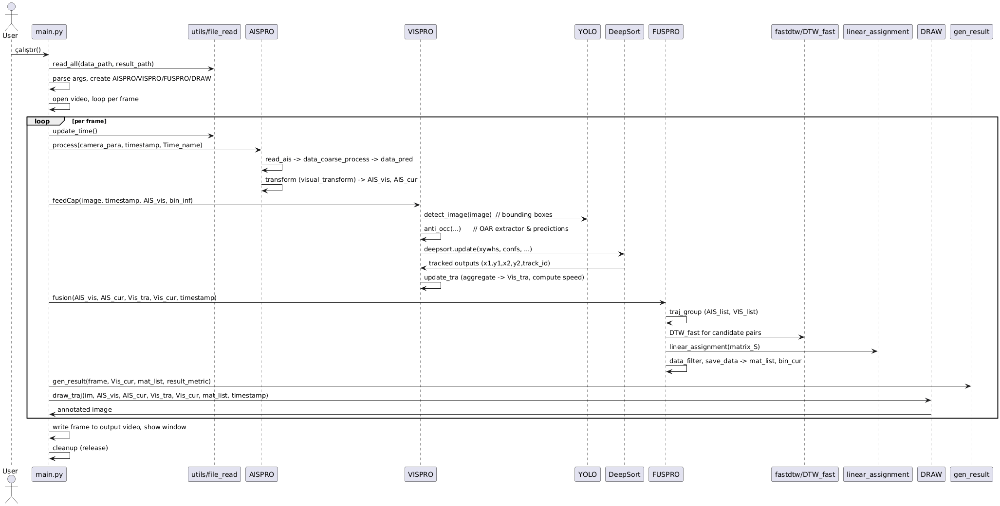
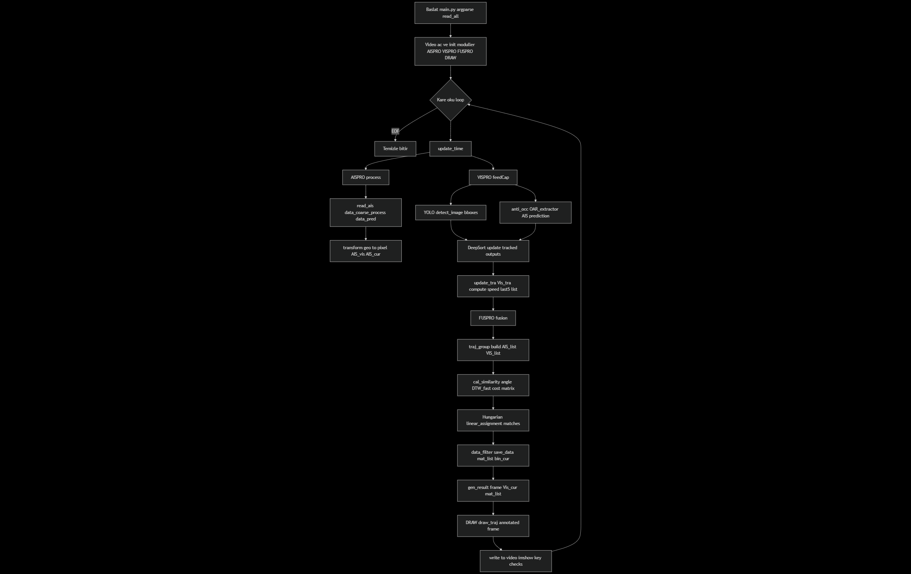

## Genel İşleyiş Özeti

DeepSORVF: Video görüntüleri (gemi kamerası) ile AIS verilerini eşleştirip, görsel tespitleri (YOLO) çoklu-nesne izleme (DeepSort) ile izleyip, AIS konum/özellikleriyle zaman-serisi benzerliği (DTW) ve atama (Hungarian) kullanarak görsel nesne ID ↔ MMSI (AIS) eşleştirmesi yapan bir füzyon boru hattıdır. Çıktı: anotasyonlu video + detection / tracking / fusion CSV metrikleri.

Kısa giriş-akışı:
- Program `main.py` ile başlar.
- Her karede zaman güncellenir.
- AIS okunur ve projeksiyonla piksel koordinatına çevrilir (AISPRO).
- YOLO ile tespit (VISPRO.detection).
- DeepSort ile izleme (VISPRO.track / update_tra).
- DTW + Hungarian ile AIS ↔ VIS traj eşleme (FUSPRO.fusion).
- Sonuçlar yazılır, overlay çizilir (DRAW).

## Adım Adım İşlem Hattı Açıklaması

Aşağıda ana adımları, çağrı sırasını, her fonksiyonun ne yaptığını ve kullanılan veri şekillerini (kısaca) veriyorum.

1) Program başlangıcı
- Dosya: `main.py`
- Giriş noktası: `if __name__ == '__main__'` -> argparse ile argümanlar hazırlanır.
- `read_all(data_path, result_path)` çağrılır (`utils/file_read.py`) → video dosyası, ais klasörü, başlangıç zaman listesi (`initial_time`), `camera_para` okunur. Dönenler `video_path, ais_path, result_video, result_metric, initial_time, camera_para`.

2) main(arg) başlatılır
- Video açılır: `cap = cv2.VideoCapture(arg.video_path)`; `im_shape` (frame genişlik/yükseklik) ve fps alınır.
- Nesne örnekleri oluşturulur:
  - `AIS = AISPRO(arg.ais_path, ais_file, im_shape, t)` (AIS veri işleme)
  - `VIS = VISPRO(arg.anti, arg.anti_rate, t)` (görsel tespit + izleme)
  - `FUS = FUSPRO(max_dis, im_shape, t)` (füzyon/eşleştirme)
  - `DRA = DRAW(im_shape, t)` (görselleştirme)

3) Ana frame döngüsü (while True: per-frame)
Her döngü:
- Kare okunur `im = cap.read()`
- Zaman güncellemesi: `Time, timestamp, Time_name = update_time(Time, t)` (`utils/file_read.time2stamp` ve `update_time`)
  - Burada `timestamp` milisaniye cinsinden frame stamp'idir.
- AIS işleme: `AIS_vis, AIS_cur = AIS.process(camera_para, timestamp, Time_name)`
  - AISPRO.process:
    - Eğer timestamp uygunsa (`timestamp % 1000 < t`) -> `ais_pro` çağrılır.
    - ais_pro:
      - `read_ais(Time_name)` : o timestamp için CSV dosyasını okur (varsa).
      - `data_coarse_process` : AIS verilerini kaba filtre (anormal konum/speed/dis limitleri).
      - `data_pred` : AIS verilerinin timestamp'a göre öngörüsü / zaman düzeltmesi; (kodda 5 saat offset ekleniyor).
      - `data_tran` -> `transform` : lokasyon (lon/lat) → görüntü koordinatına dönüşüm (`visual_transform`).
        - `visual_transform` matematiği: kamera parametreleri (kamera lon/lat, çekim yönleri, yükseklik, FOV, odak) ve coğrafi uzaklık kullanılarak piksel (x,y) hesaplanır.
      - Dönen: `AIS_vis` (görüntü-uzaydaki AIS gözlemleri) ve `AIS_cur` (o anki AIS listesi).
- Görsel işlem: `Vis_tra, Vis_cur = VIS.feedCap(im, timestamp, AIS_vis, bin_inf)`
  - VISPRO.feedCap:
    - Her T (saniyeye göre ayarlanan) adımda:
      - `detection(image)` -> `yolo.detect_image(im0)` (YOLO tespiti): çıktı bboxes listesi [(x1,y1,x2,y2,label,conf), ...]
      - `anti_occ(...)` -> anti-occlusion mantığı:
        - `OAR_extractor` ile geçmiş 5-frame'teki görsel trajlardan potansiyel OAR (occlusion areas) çıkarılır.
        - Eğer AIS verisi varsa OAR içindeki gemilerin AIS'ine bakılarak tahmini anti-occluded bounding box üretilir (prediction via AIS veya traj pred).
      - `track(image, bboxes, bboxes_anti_occ, id_list, timestamp)`:
        - YOLO bbox'larını merkeze-xywh dönüşümü ile DeepSort'a (`deepsort.update(...)`) gönderir.
        - `deepsort.update` -> kalman + reid + nms + association (DeepSort kütüphanesi)
        - Çıktı (x1,y1,x2,y2,score, track_id) ile geçici `Vis_tra_cur_3` tablosuna eklenir.
      - `update_tra`:
        - `Vis_tra_cur_3`'teki aynı ID'ler için ortalama alır (smoothing), `Vis_tra_cur` oluşturur.
        - `motion_features_extraction` ile hız (speed) özelliği hesaplanır (son ve önceki trajlar karşılaştırılarak).
        - `last5_vis_tra_list` güncellenir (geçmiş 5 periyod).
    - Döner: `Vis_tra` (tüm görsel traj veritabanı), `Vis_cur` (o anki ilgili görsel objeler)
- Füzyon: `Fus_tra, bin_inf = FUS.fusion(AIS_vis, AIS_cur, Vis_tra, Vis_cur, timestamp)`
  - FUSPRO.fusion:
    - `traj_group(...)` ile AIS_vis ve Vis_tra içindeki trajleri zaman-uygunluk şartına göre listelere çevirir (her biri için numpy array halinde [ [x,y], ... ]).
    - `cal_similarity` -> matrisi oluşturur:
      - İkili benzerlik: önce angular yön farkı hesaplanır (angle function).
      - Eğer uzaklık < max_dis ve açı toleransı sağlanırsa `DTW_fast(VIS_traj, AIS_traj)` çağrılır:
        - `DTW_fast` => `fastdtw` ile zaman-alignment mesafesi hesaplanır ve açı faktörü ile ağırlıklandırılır.
        - `fastdtw` (approx DTW) zaman serileri (traj noktaları) için esnek eşleme sağlar.
      - Çıktı: benzerlik (mesafe) matrisi (büyük mesafe -> aralarında eşleştirme uygun değil).
    - `linear_assignment(matrix_S)` (Hungarian) ile en iyi satır-sütun eşleşmeleri bulunur.
    - `data_filter` ile eşleşmeler mesafe/açı eşiklerine göre temizlenir.
    - `save_data` ile eşleşmeler `mat_list` (fusion list) ve `mat_cur` / `bin_cur` (kıdemli eşleşmeler) olarak kaydedilir.
  - Döner: `mat_list` (eşleştirilmiş AIS↔VIS kayıtları), `bin_cur` (güvenli eşleşmeler)
- Sonuç üretme: zaman işaretlerinde `gen_result(times, Vis_cur, Fus_tra, arg.result_metric, im_shape)` çağrılır:
  - `gen_result` CSV'lere yazma: detection, tracking, fusion dosyalarını append eder.
- Görselleştirme: `im = DRA.draw_traj(im, AIS_vis, AIS_cur, Vis_tra, Vis_cur, Fus_tra, timestamp)`
  - DRAW.draw_traj:
    - `fusion_list` içindeki her eşleştirme için kutu/inf kutusu oluşturur (`process_img`) ve `draw` ile görüntü üzerine kutular, metinler, bağlantı çizgileri çizer.
  - VideoWriter ile karesel sonuç yazılır ve OpenCV ile gösterilir.

4) Döngü sonu/temizlik
- Döngü bitince `cap.release()`, `videoWriter.release()`, `cv2.destroyAllWindows()` çağrılır.

Veri yapıları (kısaca):
- AIS dataframe: kolonlar ['mmsi','lon','lat','speed','course','heading','type','timestamp','x','y']
- VIS dataframe: kolonlar ['ID','x1','y1','x2','y2','x','y','timestamp','speed']
- mat_list / fusion: birleştirilmiş eşleştirme satırları (ID, mmsi, x1,y1,w,h,timestamp,...)

## Kullanılan Algoritmalar ve Gerekçeleri (teknik + anlaşılır)

Aşağıda projede kullanılan ana algoritmalar, ne işe yaradıkları, neden seçildikleri ve çalışma mantıkları açıklanmıştır.

1) YOLO (You Only Look Once) — Nesne Tespiti
- Nerede: `detection_yolox/yolo.py` üzerinden `VISPRO.detection()` çağrısı ile.
- Neden: YOLO, tek geçişte hızlı bounding-box tespiti sağlar; gerçek zamanlı uygulamalarda FPS/sürat ön planda.
- Nasıl çalışır (özet):
  - Görüntü bir grid'e bölünür, ağ tek seferde her hücre için sınıf ve kutu tahmini üretir.
  - Konsept olarak daha eski R-CNN'lere göre çok daha hızlıdır; doğruluk / hız dengesi iyidir.
- Projede rolü: Her görüntü anında gemi kutularını çıkartmak (x1,y1,x2,y2,conf,label).

2) DeepSort (Kalman + ReID + Association) — Çoklu Nesne İzleme
- Nerede: `deep_sort` modülü, `VISPRO.track()` çağrısı `deepsort.update(...)`.
- Neden: DeepSort, tespitler üstünde kimlik koruyan online takip yapar; ReID ile kısa süreli kayıpları tolere etme ve Kalman filtre ile pozisyon öngörüsü sağlar.
- Nasıl çalışır (özet):
  - Her framede tespitler Kalman filtresi ile hareket tahmine göre eşleştirilir.
  - Görünüm-temelli ReID (özellik vektörleri) ile benzerlik hesaplanır; association (IoU + appearance) yapılır.
  - Yeni ID'ler atanır, ölü/kapalı track'ler silinir.
- Projedeki rolü: Görsel detections için stabil, sürekli ID ataması; VIS trajelerinin oluşmasını sağlar.

3) DTW (Dynamic Time Warping) — Zaman Serisi Benzerliği
- Nerede: `FUS_utils.DTW_fast` -> `fastdtw` kullanan fonksiyon.
- Neden: AIS trajeleri ve görsel trajeler farklı örnekleme hızlarında olabilir; DTW zaman-haritalama ile iki trajeyi esnek şekilde eşler (farklı hızlardaki eşdeğer hareketleri tayin eder).
- Nasıl çalışır (özet, anlaşılır):
  - İki zaman-serisini zamana göre hizalamaya izin vererek en kısa toplam mesafeyi bulur.
  - fastdtw, klasik DTW'ye göre daha hızlı, yaklaşık bir yöntem; büyük trajiler için tercih edilir.
- Projedeki rolü: Görsel trajeler ile AIS trajeleri arasındaki benzerlik (mesafe) skorunu hesaplamak.

4) Hungarian (Linear Assignment) — Optimal Atama
- Nerede: `scipy.optimize.linear_sum_assignment` (linear_assignment) kullanımı `FUSPRO.traj_match`.
- Neden: Birçok görsel ve AIS trajesi olduğunda, eşleştirmeleri küresel optimuma göre çözmek gerekir; Hungarian algoritması min-cost matching sağlar.
- Nasıl çalışır:
  - Benzerlik/mesafe matrisi verilir; algoritma eşleştirmelerin toplam maliyetini en aza indirecek satır-sütun eşleşmesini verir.
- Projedeki rolü: VIS ↔ AIS eşleştirmelerini küresel olarak optimum şekilde belirlemek.

5) Coğrafi Dönüşüm & Görsel Projeksiyon (geopy, pyproj, custom math)
- Nerede: `AIS_utils.visual_transform`, `transform`, `data_filter`
- Neden: AIS verileri lon/lat cinsindendir; bunları kamera görüntüsü koordinatına (piksel) çevirmek gerekir.
- Nasıl çalışır:
  - coğrafi uzaklık (geodesic) ve yön (getDegree) hesaplanır.
  - Kamera parametreleri (kamera lon/lat, çekim horizontal/vertical yönleri, yükseklik, FOV, odak f_x/f_y ve principal point u0/v0) kullanılarak basit bir perspektif hesaplaması uygulanır.
  - Sonuç: AIS noktasının beklenen piksel (x,y).
- Projedeki rolü: AIS noktalarının görüntüyle hizalanması; anti-occlusion için AIS'ten tahmini bbox üretimi.

6) Hız/Özellik Çıkarımı ve Anti-Occlusion Mantığı
- VISPRO.motion_features_extraction, anti_occ, OAR_extractor
- Neden: Kısa süreli kapamalar (occlusion) olduğunda, geçmiş trajlara ve AIS'e bakarak eksik görsel tespitleri tahmin etmek için.
- Nasıl çalışır:
  - Son 5 görsel periyodun trajları tutulur; OAR (occlusion areas) çıkarılır.
  - Eğer AIS var ise AIS'e bakarak pozisyon hareketinden anti-occlusion bounding box'ı hesaplanır; yoksa görsel hız ile lineer tahmin yapılır.
- Projedeki rolü: Görsel takip sürekliliğini iyileştirme, kısa süreli kayıpları telafi etme.

7) Diğer yardımcı yaklaşımlar
- Filtreleme: data_coarse_process ile AIS'te anormal veriler atılıyor (hatalı GPS, aşırı hız vs).
- Zaman düzeltmesi: AIS zamanlarında ofsetler düzeltiliyor (kodda 5 saat olarak eklenmiş).
- Görselleştirme: draw.py kutu çizimi, inf box, metin ekleme, sıralı inf yerleşimi.

Edge-case / dikkat edilmesi gerekenler:
- AIS zaman offset'i kodda sabit +5 saat uygulanmış — gerçek veri setine göre kontrol edilmeli.
- Kamera parametreleri hassas: yanlış parametreler AIS→piksel dönüşümünü bozar.
- DTW ve fastdtw parametreleri performans/kayıp dengesini etkiler (uzun trajiler maliyetli).
- DeepSort ReID checkpoint ve CUDA gereksinimi var (kod deepsort'u GPU ile çağırıyor).

---

## Sequence Diagram

*Fonksiyonlar ve sınıflar arasındaki çağrı sırasını gösteren UML sequence diyagramı*

---

## Flowchart

*Genel işleyişi kutucuklar ve karar yapıları ile gösteren akış diyagramı*