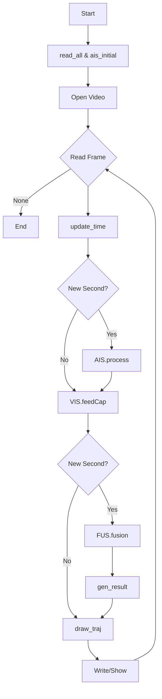

# DeepSORVF Kod İşleyiş Dokümantasyonu

Bu doküman sadece kodun çalışma akışını ve fonksiyonların NEDEN var olduklarını açıklar. Kurulum, parametre listesi gibi bölümler (8. madde ve sonrası) çıkarılmıştır. Amaç: Kodu ilk gören birinin dosyalar arasında kaybolmadan mantığı takip edebilmesi.

## 1. Amaç
Deniz üzerindeki gemileri **görsel tespit (YOLOX + DeepSORT)** ve **AIS (Automatic Identification System)** verilerini zamansal ve mekânsal olarak hizalayıp eşleştirerek tekil gerçek dünya kimlikleriyle izlemek. Fusion süreci; iki farklı kaynaktan gelen (kamera + AIS) trajeleri aynı fiziksel gemiye ait olup olmadıklarına göre birleştirir.

## 2. En Üst Düzey Döngü Mantığı
`main.py` içindeki ana while döngüsü her video karesinde şu sırayı takip eder:
1. Frame oku
2. Mantıksal zaman & timestamp güncelle (`update_time`)
3. Yeni saniyeye girildiyse AIS işleme (`AIS.process`)
4. Görsel pipeline (tespit + takip) (`VIS.feedCap`)
5. Yeni saniyeye girildiyse fusion (`FUS.fusion`)
6. Yeni saniyede sonuç CSV yazımı (`gen_result`)
7. Çizim & overlay (`DRAW.draw_traj`)
8. Video kaydı / gösterim

Temel prensip: AIS ve fusion yalnızca saniye sınırında (timestamp milisaniyesi < t eşiği) çalıştırılır, görsel tespit ise her karede yapılabilir.

---
## 3. Fonksiyonel Ayrıntılar (NEDEN / NASIL)

### 3.1 Giriş & Zaman Yönetimi (`utils/file_read.py`)
- `read_all(data_path, result_path)`: Video dosyasını, AIS klasörünü, çıktı dizinlerini ve kamera parametre dosyasını bulur. Neden: Tüm pipeline tek merkezli yapılandırma bilgisine ihtiyaç duyar.
- `ais_initial(ais_path)`: AIS CSV dosyalarının listesini ve ilk zaman etiketini çıkarır. Neden: Saniye bazlı erişimde dizin taramasını her döngüde tekrar etmemek.
- `update_time(Time, t)`: Frame sayacından milisaniye bazında ilerleyerek yeni bir tam saniyeye geçtiğimiz anı belirler. Neden: AIS ve fusion işlemlerinin yalnızca saniye başında tetiklenebilmesi.
- `time2stamp(hhmmss)`: İnsan okunur zaman → milisaniye epoch. Neden: Farklı kaynaklardan gelen zaman formatlarını normalize etmek.

### 3.2 AIS İşleme Zinciri (`utils/AIS_utils.py`)
Ana giriş noktası: `AISPRO.process(camera_para, timestamp, Time_name)`
Bu fonksiyon yalnızca yeni saniye tetik koşulunda çalışır (fazladan hesap yükünü engeller).

Adımlar:
1. `initialization()`: Geçici listeleri temizler. Neden: Saniyelik state kalıntılarının yeni okunan veriyle karışmasını önlemek.
2. `ais_pro(...)`: İç içe iş akışı.
   - `read_ais(Time_name)`: O saniyeye ait CSV var mı? Varsa satırları okuyup parse eder. Neden: Gerçek zamanlı akışın dosya tabanlı simülasyonu.
   - `data_coarse_process(AIS_read, AIS_las, camera_para, max_dis)`: Hatalı / aşırı uzak / hız mantıksız kayıtlar elenir. Neden: Fusion maliyet matrisinin kirlenmesini ve yanlış pozitifleri azaltmak.
   - `data_pred(AIS_cur, AIS_read, AIS_las, timestamp)`: (a) TIME_OFFSET düzeltmesi (örn. +5h fark) (b) Eksik saniyeleri son iki geçerli noktanın hızı ve kursuyla ileri projekte eder (`data_pre`). Neden: Kamera ve AIS zaman drift’i & paket kayıplarına karşı sürekli trajekte tutarlılık.
   - `data_tran(...)` → `transform()` + `visual_transform()`: Coğrafi (lat/lon) → düzlemsel piksel koordinatı. Bearing + mesafe + kamera parametresi kullanır. Neden: Görsel uzay ile sayısal navigasyon verisini aynı koordinat sistemine getirmek.
Çıktılar: `AIS_cur` (ham senkronize edilmiş), `AIS_vis` (piksel lokasyonlu).

Kritik Nokta: Hız 0 iken yön bilgisi (course) gürültülü olabilir; filtre bunu dikkate alır veya prediction kısmı durur.

### 3.3 Görsel Pipeline (`utils/VIS_utils.py`)
Giriş noktası: `VISPRO.feedCap(frame, timestamp, AIS_vis, bin_inf)`

Adımlar:
1. `detection()`: YOLOX modeli çalışır, gemi aday kutuları çıkar. Neden: Ham görsel akıştan potansiyel hedefleri izole etmek.
2. `anti_occ(...)`: Örtüşen kutuları ve olası kaybolan hedefleri analiz eder (tamamlanmamış logic). Neden: Geçici kayıplarda kimlik sürekliliğini koruma hedefi.
3. `track(...)`: DeepSORT; her tespit için appearance + motion (Kalman) bileşimi ile ID ataması yapar. Neden: Kutu dizisini zamansal kimlik dizisine dönüştürmek.
4. `update_tra(...)`: Yeni saniyede gerçekleşir; aynı ID'nin o saniyedeki çoklu örnekleri ortalanır; `motion_features_extraction` ile hız / yön çıkarılır. Neden: Fusion için daha kararlı saniyelik temsil üretmek.

Çıktılar: `Vis_cur` (o karedeki ID'ler), `Vis_tra` (son ~2 dakikalık geçmiş penceresi). Bu geçmiş pencere DTW hesaplarında dokusuz (sparse) yerine yoğun (dense) örnek sunar.

### 3.4 Fusion (`utils/FUS_utils.py`)
Giriş: `FUSPRO.fusion(AIS_vis, AIS_cur, Vis_tra, Vis_cur, timestamp)`

Alt Akış:
1. `traj_group(... 'AIS')` ve `traj_group(... 'VIS')`: Her kimlik için zaman sıralı (x,y) noktalar listesini derler. Neden: DTW gibi sekans tabanlı karşılaştırmalar için ham nokta akışını gruplamak.
2. `traj_match(...)`: Orkestrasyon.
   - `initialization()`: Önceki saniyeden gelen eşleşme geçmişini (`mat_las`) alır; uzun vadeli istikrar için gerekli.
   - `cal_similarity()`: Her VIS–AIS çifti için:
     * Son konum mesafesi (gating) – çok uzaksa yüksek maliyet.
     * `angle()` ile yön farkı – aşırı sapmalar cezalandırılır.
     * `DTW_fast()`: Sekansları önce downsample eder (`__reduce_by_half`), ardından fastdtw ile yol maliyeti bulur, açı penalti uygulayarak nihai skor üretir.
     * Önceden bağlanmış çiftlere negatif offset (süreklilik ödülü).
   - Hungarian (`linear_assignment`) ile toplam maliyet minimizasyonu.
   - `data_filter(...)`: İkincil sert eşikler (mesafe < max_dis, açı < limit) – yanlış pozitif süzgeci.
   - `save_data(...)`: Eşleşme sayaçlarını (match count) günceller, geçici kayıplara tolerans tanır (fog tolerance). Neden: Kısa süreli occlusion sırasında ilişkiyi koparmamak.
Çıktılar: `mat_list` (saniyelik fusion kayıtları), `bin_cur` (aktif bağlar tablosu).

### 3.5 Çizim (`utils/draw.py`)
- `draw_traj(...)`: Her görsel ID'yi işler, eğer `bin_cur` ile bir AIS eşleşmesi varsa kutuyu ve metni sarı renkte; yoksa kırmızı renkte çizer. Neden: Operatöre durumu hızlı görsel geri bildirimle iletmek.
- Yardımcılar `draw_box`, `draw_line`: Görsel bütünlük ve okunabilirlik için basit overlay araçları.

### 3.6 Sonuç Kaydı (`utils/gen_result.py`)
- `gen_result(...)`: Üç CSV setini saniye bazında append eder: detection (ham kare tespitleri), tracking (ID'li kutular), fusion (AIS ile zenginleştirilmiş ID'ler). Neden: Post-analiz, metrik hesaplama ve hata ayıklama.

## 4. Önemli Veri Yapıları
- AIS satırı: `[mmsi, lon, lat, speed, course, heading, type, timestamp, x, y]`
- Visual track satırı: `[ID, x1, y1, x2, y2, x, y, speed, timestamp]`
- Fusion çıktı satırı: `[ID, mmsi, lon, lat, speed, course, heading, type, x1, y1, w, h, timestamp]`
- Binding (`bin_cur`): `[ID, mmsi, timestamp, match]`

## 5. Fusion Karar Kuralları (Kısa)
1. Geometrik yakınlık ve yön uyumu ilk kapı.
2. Zaman serisi benzerliği DTW ile ölçülür (ölçek & açı cezalı).
3. Hungarian ile global optimum eşleşme.
4. Son sert kapı + istikrar puanı (match count) → nihai bağ.
5. Kısa kayıplar toleransla tutulur (fog tolerance).

Mermaid Kaynağı:


ASCII Özet:
```
Frame -> update_time -> (sec?) AIS.process -> VIS.feedCap -> (sec?) FUS.fusion -> (sec?) gen_result -> draw_traj -> output -> next frame
```

## 6. Neden DTW + Hungarian?
- DTW: Farklı hız / ufak zaman kaymaları olsa bile yol şeklinin (trajectory pattern) benzerliğini ölçer.
- Hungarian: Tüm VIS ↔ AIS aday çiftleri aynı anda optimize ederek lokal hatalı seçimi engeller.
- Birlikte: Gürültülü tek frame uzaklıklarına dayanmak yerine sekans bağlamı + global optimizasyon.