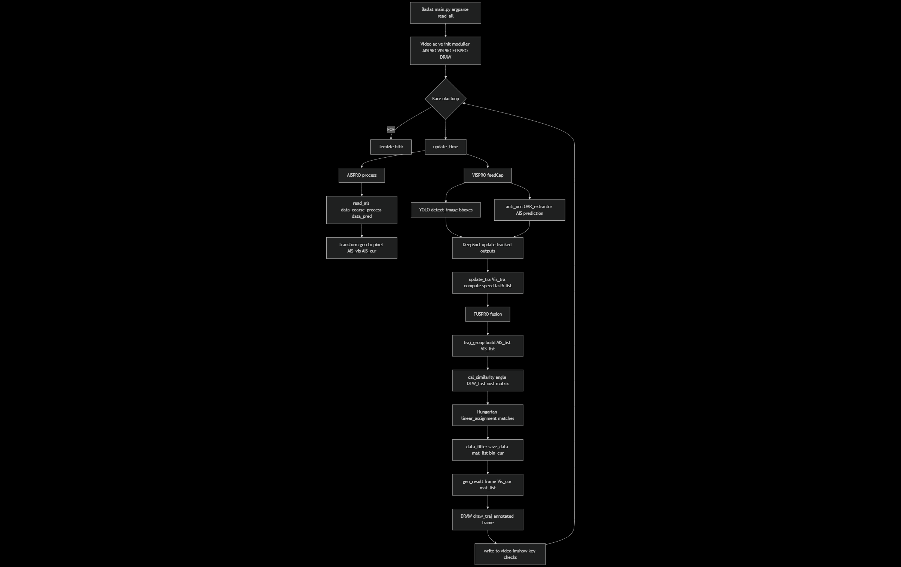
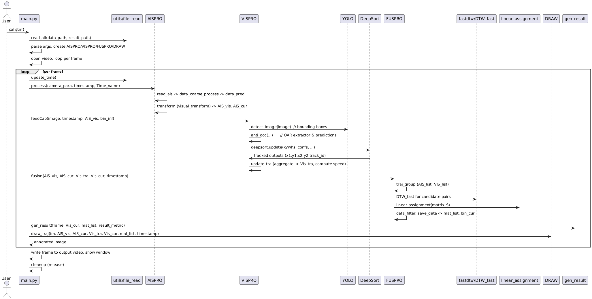

<div align="center">

[English](#english) | [Türkçe](#türkçe)

</div>

---

<a name="english"></a>
# Vessel Tracking and AIS Sensor Fusion System

DeepSORVF (Deep learning-enabled Asynchronous Trajectory Matching-based Vessel Data Fusion) is a hybrid maritime surveillance and identification system that merges visual video streams captured by vessel/shore cameras with AIS (Automatic Identification System) radio broadcasts using spatiotemporal optimal trajectory matching algorithms.

This project associates visual ship detections (YOLO) and multi-object tracking (ByteTrack) with corresponding AIS MMSI numbers, speed, course, and latitude/longitude coordinates, presenting synchronized visual and geospatial telemetry in a single tactical Command and Control (C2) web dashboard.

---

## System Architecture & Core Components

The architecture consists of four primary processing engines:

1. **VISPRO (Visual Perception & Tracking Engine):**
   - Object detection powered by Ultralytics YOLOv8 and YOLO11 architectures with PyTorch CUDA GPU acceleration.
   - Cross-frame track ID persistence and identity consistency via ByteTrack and BoT-SORT algorithms.
   - Anti-Occlusion trajectory estimation using historical motion vectors to prevent ID switching during vessel overlap.

2. **AISPRO (AIS Kinematics & Geodesic Projection Engine):**
   - Outlier rejection filtering for invalid GPS coordinates and unrealistic speed spikes in marine radio broadcasts.
   - PyProj WGS84 geodesic forward kinematic extrapolation for missing timestamp estimation.
   - Dynamic 3D Pinhole camera matrix projection (Heading, Pitch, Height, Focal Length/FOV) mapping 3D geographical coordinates (Lat, Lon) to 2D image plane pixels (X, Y).

3. **FUSPRO (Sensor Fusion & Spatiotemporal Association Engine):**
   - Multi-feature trajectory similarity calculation comparing course angle deviation, speed, aspect ratio, and Euclidean distance.
   - FastDTW (Fast Dynamic Time Warping) algorithm constructing a time-aligned cost matrix across asynchronous feeds.
   - Global optimal Hungarian (Linear Sum Assignment) solver associating Visual Track IDs with AIS MMSI numbers.

4. **Web C2 (Command & Control Web Dashboard):**
   - Real-time 30 FPS MJPEG video streaming and 10 Hz WebSocket telemetry powered by FastAPI and Uvicorn.
   - Interactive Leaflet.js maritime map supporting OpenStreetMap, Esri World Imagery, and OpenSeaMap nautical marks.
   - Dark Ship / Unidentified Target early-warning engine for vessels navigating without active AIS broadcasts.

---

## Technical Stack

- **Programming Language:** Python 3.10+
- **Deep Learning & Tracking:** Ultralytics (YOLOv8 / YOLO11), PyTorch (CUDA Accelerated), ByteTrack
- **Computer Vision:** OpenCV, NumPy, Pillow, Imutils
- **Geospatial & Mathematical Algorithms:** PyProj, GeoPy, SciPy, FastDTW
- **Web & Interface:** FastAPI, Uvicorn, WebSockets, HTML5, CSS3, JavaScript, Leaflet.js, OpenSeaMap
- **Hardware & Telemetry Monitoring:** Psutil, GPUtil, Pynvml

---

## Architecture Diagrams





---

## Project Structure

```
DeepSORVF/
├── data/                    # Sample benchmark dataset (Video, AIS CSV logs, GT)
├── docs/                    # Architectural flowcharts and sequence diagrams (PNG)
│   ├── flowchart.png
│   └── sequence_diagram.png
├── models/                  # Ultralytics YOLOv8 and YOLO11 weights (.pt)
│   ├── yolov8n.pt / yolov8s.pt / yolov8m.pt / yolov8l.pt / yolov8x.pt / yolo11x.pt
├── result/                  # Export results and evaluation metrics (.gitignore)
├── tests/                   # Benchmark validation test suite
│   └── test_benchmark.py    # Ground Truth MOTA, IDF1 benchmark evaluation script
├── core/                    # Core AI, Fusion and Kinematics Package
│   ├── ais_processor.py     # AIS geodesic calculations and 3D pinhole projection
│   ├── vis_processor.py     # Visual detection, ByteTrack tracking & anti-occlusion
│   ├── fusion_processor.py  # Multi-Feature FastDTW and Hungarian optimal assigner
│   ├── ekf_fusion.py        # Extended Kalman Filter (EKF) with 5s coasting memory
│   ├── time_sync.py         # NCC Automatic Timestamp Synchronizer
│   ├── yolo_detector.py     # Ultralytics YOLOv8/v11 PyTorch CUDA detector
│   ├── byte_tracker.py      # ByteTrack / BoT-SORT multi-object tracker
│   ├── visualizer.py        # Video HUD tactical overlay and telemetry visualizer
│   ├── live_stream.py       # Zero-cost YouTube Live HLS + aisstream.io connector
│   ├── camera_profiles.py   # Maiden's Tower, Bosphorus, Rotterdam camera presets
│   ├── stream_simulator.py  # Offline historical archive replayer simulator
│   └── data_loader.py       # Dataset reader and configuration helper
├── web/                     # Local Web Command & Control Dashboard (Web C2)
│   ├── server.py            # FastAPI server and real-time WebSocket telemetry engine
│   └── static/              # HTML, CSS and JavaScript frontend assets
│       ├── index.html       # Command and control dashboard interface
│       ├── css/style.css    # Modern tactical dark-mode C2 UI styling
│       └── js/app.js        # Leaflet map logic and WebSocket client
├── requirements.txt         # Project dependencies
├── README.md                # Bilingual documentation
└── .gitignore               # Git ignore rules
```

---

## Installation & Usage

### 1. Install Dependencies

Install all required Python packages using pip:

```bash
pip install -r requirements.txt
```

### 2. Launch Web Command & Control Dashboard (Web C2)

Start the local dashboard server:

```bash
python web/server.py
```

Once started, open your web browser and navigate to:

```
http://localhost:8000
```

Dashboard Features:
- Mode Selection: Toggle dynamically between File Replayer (Archive Dataset) and Live Web Stream (Real-Time Shore Cameras).
- Model Selection: Hot-swap between YOLOv8x, YOLOv8l, YOLOv8m, YOLOv8s, YOLOv8n, and YOLO11x models on the fly.
- Nautical Chart: Enable OpenSeaMap navigation aids and sea marks from the upper-right layer control.
- Live Calibration: Adjust camera heading, pitch, height, and field-of-view (FOV) in real-time.

### 3. Run Ground Truth Benchmark Evaluation

Evaluate visual tracking and sensor fusion accuracy metrics (MOTA, IDF1, Precision, Recall) against Ground Truth annotations:

```bash
python tests/test_benchmark.py
```

---

## Data Streaming Modes

1. **File Mode (Offline Archive Simulation):**
   Reads local MP4 video recordings and chronologically ordered AIS CSV files frame-by-frame, simulating real-time playback for deterministic benchmarking and testing.

2. **Live Web Stream Mode (Zero-Cost Live Internet Stream):**
   Streams 24/7 high-definition maritime video directly from YouTube live feeds via `streamlink` and connects to the `aisstream.io` global WebSocket service to ingest and fuse real-world ship radio telemetry in real-time.

<br>

---

<a name="türkçe"></a>
# Gemi Takip ve AIS Sensör Füzyon Sistemi

DeepSORVF (Deep learning-enabled Asynchronous Trajectory Matching-based Vessel Data Fusion), gemi kameralarından alınan görsel video akışları ile AIS (Automatic Identification System) telsiz verilerini zaman-mekansal optimal eşleştirme algoritmaları kullanarak birleştiren hibrit bir denizcilik takip ve kimliklendirme sistemidir.

Bu proje, kamera görüntüsündeki gemi tespitlerine (YOLO) ve çoklu nesne takibine (ByteTrack) karşılık gelen AIS MMSI numaralarını, hız, rota ve enlem/boylam bilgilerini eşleştirerek görsel ve coğrafi veriyi tek bir komuta kontrol panelinde sunar.

---

## Sistem Mimarisi ve Temel Bileşenler

Sistem mimarisi dört ana işlem modülünden oluşmaktadır:

1. **VISPRO (Görsel Algılama ve Takip Modülü):**
   - Ultralytics YOLOv8 ve YOLO11 mimarileri kullanılarak PyTorch CUDA ivmelendirmesi ile gemi tespiti yapılır.
   - ByteTrack ve BoT-SORT algoritmaları ile nesnelerin kareler arası kimlik (ID) sürekliliği korunur.
   - Gemi kapanmaları (occlusion) durumunda geçmiş hareket vektörlerinden faydalanılarak Anti-Occlusion tahmini üretilir.

2. **AISPRO (AIS İşleme ve Coğrafi Projeksiyon Modülü):**
   - AIS telsiz verilerindeki geçersiz koordinat ve mantıksız hız sıçramaları filtrelenir.
   - PyProj WGS84 jeodezik ileri öngörü formülleri ile eksik zaman damgaları tahmin edilir.
   - Kamera açısı, yüksekliği, odak uzaklığı ve bakış yönü kullanılarak 3D coğrafi koordinatlar (Lat, Lon) 2D piksel koordinatlarına (X, Y) dönüştürülür.

3. **FUSPRO (Sensör Füzyon ve Atama Modülü):**
   - Görsel iz zaman serileri ile AIS projeksiyon izleri arasındaki yön açısı farkı ve mesafe hesaplanır.
   - FastDTW (Fast Dynamic Time Warping) algoritması kullanılarak zaman-hizalamalı benzerlik maliyet matrisi oluşturulur.
   - Macar (Hungarian / Linear Sum Assignment) algoritması ile küresel minimum maliyetli Görsel ID ↔ AIS MMSI eşleştirmesi çözülür.

4. **Web C2 (Yerel Komuta Kontrol Arayüzü):**
   - FastAPI ve WebSocket mimarisi ile 30 FPS canlı video akışı ve 10 Hz telemetri yayını sağlanır.
   - Leaflet.js altyapısında OpenStreetMap, Esri World Imagery ve OpenSeaMap denizcilik harita katmanları sunulur.
   - AIS yayını yapmayan veya eşleşmeyen gemiler için Tanımsız Hedef (Dark Ship) ikaz sistemi çalışır.

---

## Teknolojik Altyapı

- **Programlama Dili:** Python 3.10+
- **Derin Öğrenme ve Takip:** Ultralytics (YOLOv8 / YOLO11), PyTorch (CUDA İvmelendirmeli), ByteTrack
- **Görüntü İşleme:** OpenCV, NumPy, Pillow, Imutils
- **Coğrafi ve Matematiksel Hesaplama:** PyProj, GeoPy, SciPy, FastDTW
- **Web ve Arayüz:** FastAPI, Uvicorn, WebSockets, HTML5, CSS3, JavaScript, Leaflet.js, OpenSeaMap
- **Sistem İzleme:** Psutil, GPUtil, Pynvml

---

## Sistem Mimarisi ve Akış Şemaları


---

## Proje Dizin Yapısı

```
DeepSORVF/
├── data/                    # Örnek test veri seti (Video, AIS CSV verileri, GT)
├── docs/                    # Mimari akış ve sıralı işlem şemaları (PNG)
│   ├── flowchart.png
│   └── sequence_diagram.png
├── models/                  # Ultralytics YOLOv8 ve YOLO11 ağırlık dosyaları
│   ├── yolov8n.pt / yolov8s.pt / yolov8m.pt / yolov8l.pt / yolov8x.pt / yolo11x.pt
├── result/                  # Olay yakalama ve analiz çıktıları (.gitignore)
├── tests/                   # Benchmark doğrulama testleri
│   └── test_benchmark.py    # Ground Truth MOTA, IDF1 benchmark doğrulama betiği
├── core/                    # Çekirdek İşlem ve Füzyon Paketi
│   ├── ais_processor.py     # AIS jeodezik hesaplama ve coğrafi projeksiyon
│   ├── vis_processor.py     # Görsel tespit, takip ve Anti-Occlusion
│   ├── fusion_processor.py  # Multi-Feature FastDTW ve Hungarian eşleştirici
│   ├── ekf_fusion.py        # Genişletilmiş Kalman Filtresi (EKF) ve 5s Coasting
│   ├── time_sync.py         # NCC Otomatik Zaman Senkronizasyonu
│   ├── yolo_detector.py     # Ultralytics YOLOv8/v11 PyTorch CUDA dedektörü
│   ├── byte_tracker.py      # ByteTrack / BoT-SORT çoklu nesne takipçisi
│   ├── visualizer.py        # Video üzerine HUD çerçeve ve bilgi paneli çizimi
│   ├── live_stream.py       # YouTube Live + aisstream.io canlı akış bağlayıcı
│   ├── camera_profiles.py   # Kız Kulesi, Boğaz, Rotterdam hazır kamera profilleri
│   ├── stream_simulator.py  # Offline arşiv replayer akış simülatörü
│   └── data_loader.py       # Veri seti okuma ve konfigürasyon yardımcısı
├── web/                     # Yerel Web Komuta Kontrol Paneli (Web C2)
│   ├── server.py            # FastAPI sunucusu ve WebSocket telemetri motoru
│   └── static/              # HTML, CSS ve JavaScript frontend dosyaları
│       ├── index.html       # Komuta kontrol ana ekranı
│       ├── css/style.css    # Dark-mode C2 arayüz tasarımı
│       └── js/app.js        # Leaflet harita ve WebSocket istemci mantığı
├── requirements.txt         # Proje bağımlılık listesi
├── README.md                # Proje dokümantasyonu
└── .gitignore               # Git dışlama kuralları
```

---

## Kurulum ve Kullanım

### 1. Bağımlılıkların Yüklenmesi

Gerekli Python paketlerini yüklemek için terminalde aşağıdaki komutu çalıştırın:

```bash
pip install -r requirements.txt
```

### 2. Web Komuta Kontrol Panelinin (Web C2) Başlatılması

Arayüzü başlatmak için sunucu betiğini çalıştırın:

```bash
python web/server.py
```

Sunucu başladıktan sonra web tarayıcınızda aşağıdaki adrese gidin:

```
http://localhost:8000
```

Arayüz Özellikleri:
- Mod Seçimi: File Replayer (Arşiv Videoları) veya Live Web Stream (Canlı Yayın).
- Model Seçimi: YOLOv8x, YOLOv8l, YOLOv8m, YOLOv8s, YOLOv8n ve YOLO11x modelleri arasında dinamik geçiş.
- Deniz Haritası: Sağ üst köşedeki katman butonundan OpenSeaMap katmanı aktif edilebilir.
- Canlı Kalibrasyon: Kamera açısı, eğimi, yüksekliği ve görüş alanı anlık olarak ayarlanabilir.

### 3. Ground Truth Benchmark Değerlendirme Testi

Sistemin doğruluk metriklerini (MOTA, IDF1, Precision, Recall) Ground Truth verileriyle kıyaslamak için:

```bash
python tests/test_benchmark.py
```

---

## Veri Akış Modları

1. **File Mode (Çevrimdışı / Arşiv Simülasyonu):**
   Diskte yer alan MP4 videolarını ve zamana göre sıralanmış AIS CSV dosyalarını kare kare okuyarak gerçek zamanlı gibi işler. Başarım ölçümü ve testler için kullanılır.

2. **Live Web Stream Mode (Canlı İnternet Akışı):**
   `streamlink` kütüphanesi aracılığıyla YouTube üzerindeki 7/24 deniz canlı yayınlarından video akışı alır ve `aisstream.io` WebSocket servisine bağlanarak anlık coğrafi bölgedeki gerçek gemi telsiz verilerini çekip eşleştirir.